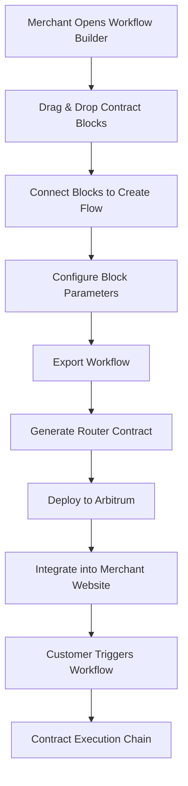
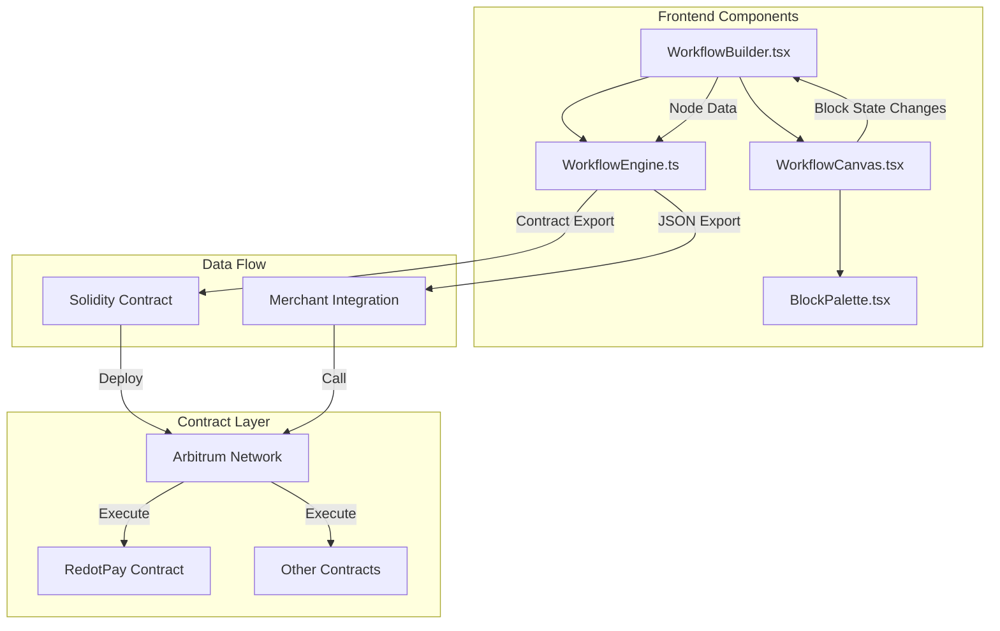
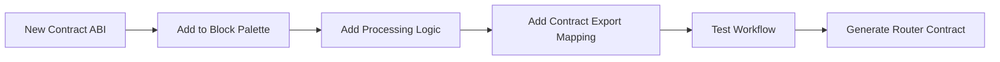

# Application Flow Guide - Contract Integration Architecture

## 🏗️ High-Level Architecture Flow



## 🔄 Detailed Component Flow



## 🎯 Core Application Logic (Without UI)

### 1. Block System Architecture

```typescript
// Core block data structure
interface WorkflowBlock {
  id: string          // Unique identifier
  name: string        // Display name
  type: string        // Contract method type (e.g., "redot-accept-payment")
  x: number          // Canvas position
  y: number          // Canvas position
  connections: string[] // Connected block IDs
  config: Record<string, any> // Method parameters
}

// Block definition for palette
interface BlockDefinition {
  id: string           // Maps to WorkflowBlock.type
  name: string         // Display name
  description: string  // Tooltip text
  icon: Icon          // React icon (UI only)
  color: string       // CSS classes (UI only)
}
```

### 2. Workflow Engine Core Logic

```typescript
// Key methods in WorkflowEngine class

class WorkflowEngine {
  // Converts UI blocks to executable workflow
  exportWorkflowForContract(workflowId: string, nodes: WorkflowNode[]): WorkflowContractExport
  
  // Generates Solidity contract code
  generateRouterContractCode(workflowExport: WorkflowContractExport): string
  
  // Maps block types to contract calls
  private nodeToContractCall(node: WorkflowNode): ContractCall
  
  // Processes individual contract blocks
  private processNode(node: WorkflowNode, context: Record<string, any>): Promise<any>
}
```

### 3. Contract Integration Points

## 🔌 Integration Flow for New Contracts



## 📝 Step-by-Step Integration Guide

### Step 1: Define Contract ABI
```typescript
// lib/your-contract-abi.ts
export const YOUR_CONTRACT_ABI = [
  {
    inputs: [
      { name: "param1", type: "address" },
      { name: "param2", type: "uint256" }
    ],
    name: "yourMethod",
    outputs: [{ name: "result", type: "uint256" }],
    stateMutability: "nonpayable",
    type: "function",
  }
] as const

export const YOUR_CONTRACT_ADDRESS = "0x..."
```

### Step 2: Add Block Definition
```typescript
// components/block-palette.tsx
const blockCategories = [
  {
    name: "Your Contract Blocks",
    blocks: [
      {
        id: "your-contract-method",  // This becomes the block type
        name: "Your Method Name",
        description: "What this method does",
        icon: SomeIcon,  // Choose appropriate icon
        color: "bg-color-classes"  // UI styling
      }
    ]
  }
]
```

### Step 3: Add Processing Logic
```typescript
// lib/automation/workflow-engine.ts

// Add to processNode switch statement
case "your-contract-method":
  return this.processYourContractMethod(node, context)

// Add the processing method
private async processYourContractMethod(node: WorkflowNode, context: Record<string, any>) {
  const { param1, param2 } = node.config
  
  return {
    callId: `your_call_${Date.now()}`,
    contractMethod: "yourMethod",
    contractAddress: "YOUR_CONTRACT_ADDRESS",
    parameters: { param1, param2 },
    transactionHash: "0x...", // Mock or real tx hash
    status: "executed",
    timestamp: Date.now(),
  }
}
```

### Step 4: Add Contract Export Mapping
```typescript
// lib/automation/workflow-engine.ts

// Add to nodeToContractCall switch statement
case "your-contract-method":
  return {
    ...baseCall,
    contractAddress: "{{YOUR_CONTRACT_ADDRESS}}",
    methodName: "yourMethod",
    abi: "yourMethod(address,uint256)",
    parameterTypes: ["address", "uint256"],
    parameterNames: ["param1", "param2"],
    gasEstimate: 100000,  // Estimate gas usage
    requiresApproval: false,  // Whether it needs token approval
  } as ContractCall
```

## 🚀 Generated Contract Structure

The system generates this Solidity template:

```solidity
contract WorkflowRouter_${workflowId} {
    // Contract interfaces for all used contracts
    IYourContract public yourContract;
    IRedotPayVault public redotPayVault;
    
    // Main execution function with all required parameters
    function executeWorkflow(
        address param1,
        uint256 param2,
        // ... other parameters from all blocks
    ) external onlyOwner {
        uint256 executionId = ++executionCounter;
        
        // Sequential execution of contract calls
        yourMethod(param1, param2);
        redotPayVault.acceptPayment(token, amount, recipient, condition, release_time);
        
        executionCompleted[executionId] = true;
        emit WorkflowExecuted(executionId, msg.sender);
    }
    
    // Individual method wrappers
    function yourMethod(address param1, uint256 param2) internal {
        yourContract.yourMethod(param1, param2);
    }
}
```

## 🔗 End-to-End Data Flow

### 1. Block Creation → Canvas State
```typescript
// When user drags block to canvas
const newBlock: WorkflowBlock = {
  id: `${blockData.id}-${Date.now()}`,
  name: blockData.name,
  type: blockData.id,  // This links to contract method
  x: positionX,
  y: positionY,
  connections: [],
  config: {}  // User fills this in settings panel
}
```

### 2. Canvas State → Workflow Engine
```typescript
// Convert UI blocks to engine nodes
const convertBlocksToNodes = (blocks: WorkflowBlock[]) => {
  return blocks.map(block => ({
    id: block.id,
    type: block.type,        // Key field for contract mapping
    name: block.name,
    config: block.config,    // Contract parameters
    connections: block.connections,
    position: { x: block.x, y: block.y }
  }))
}
```

### 3. Workflow Engine → Contract Generation
```typescript
// Export process
const contractExport = workflowEngine.exportWorkflowForContract(workflowId, nodes)
const solidityCode = workflowEngine.generateRouterContractCode(contractExport)
```

### 4. Contract Deployment → Merchant Integration
```javascript
// Merchant website integration
const workflowContract = new web3.eth.Contract(abi, deployedAddress);

// Customer triggers workflow
await workflowContract.methods.executeWorkflow(
  userAddress,    // param1
  paymentAmount,  // param2
  // ... other parameters
).send({ from: merchantAddress });
```

## 🎛️ Key Configuration Points

### Block Parameter Configuration
```typescript
// In workflow-settings.tsx or block configuration UI
const blockConfig = {
  // For redot-accept-payment block
  token: "0xTokenAddress",
  amount: "1000000000000000000", // 1 ETH in wei
  recipient: "0xMerchantAddress",
  condition: 1,
  releaseTime: Math.floor(Date.now() / 1000) + 86400 // 24 hours
}
```

### Contract Address Configuration
```typescript
// Update contract addresses before deployment
const CONTRACT_ADDRESSES = {
  REDOT_PAY: "0xActualRedotPayAddress",
  YOUR_CONTRACT: "0xYourContractAddress",
  PRICE_ORACLE: "0xOracleAddress"
}
```

## 🔄 Execution Flow Summary

1. **Design Phase**: Merchant creates workflow visually
2. **Configuration Phase**: Sets parameters for each block
3. **Export Phase**: System generates contract-ready JSON + Solidity code
4. **Deployment Phase**: Merchant deploys router contract to Arbitrum
5. **Integration Phase**: Merchant integrates contract call into website
6. **Execution Phase**: Customer actions trigger the automated workflow

This architecture makes adding new contracts a matter of following the 4-step pattern, while the UI and workflow management is completely abstracted away.
