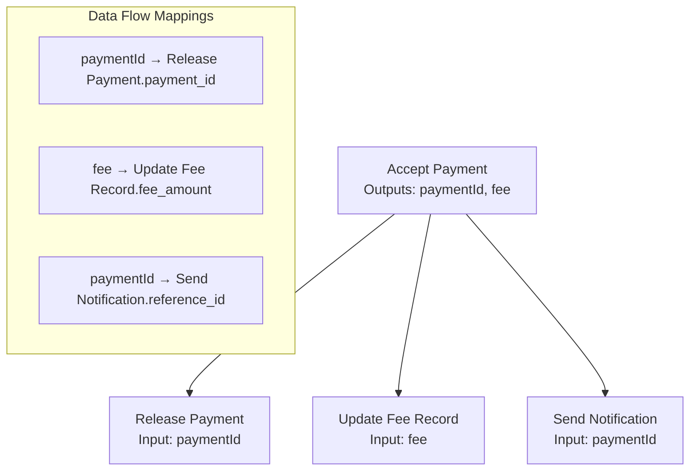

# Complete Data Flow System - Output to Input Mapping

## 🎯 **Real World Example: Multi-Output Merchant Payment Flow**

Let's say you have this workflow that perfectly demonstrates the data flow system:

### **Visual Workflow:**
```
[Accept Payment] → [Release Payment] 
                  → [Update Fee Record]
                  → [Send Notification]
```

**Where:**
- `Accept Payment` outputs: `(paymentId: uint256, fee: uint256)`
- `Release Payment` needs: `paymentId` from Accept Payment
- `Update Fee Record` needs: `fee` from Accept Payment  
- `Send Notification` needs: `paymentId` from Accept Payment

---

## 🏗️ **System Architecture with Data Flow**



---

## 📊 **Complete Export Object with Data Flow**

### **Enhanced WorkflowContractExport:**
```json
{
  "workflowId": "merchant-multi-output-flow",
  "version": "1.0.0",
  "contractCalls": [
    {
      "nodeId": "accept-payment-123",
      "nodeName": "Accept Payment",
      "contractAddress": "{{REDOT_PAY_CONTRACT_ADDRESS}}",
      "methodName": "acceptPayment",
      "abi": "acceptPayment(address,uint256,address,uint256,uint256)",
      "parameterTypes": ["address", "uint256", "address", "uint256", "uint256"],
      "parameterNames": ["token", "amount", "recipient", "condition", "release_time"],
      "parameters": {
        "token": "0xA0b86a33E6C0cE0E8A49c6B7a3BA2a9a35e8F4b0",
        "amount": "1000000000000000000",
        "recipient": "0x742d35Cc6e0F4B9F2e7a5F8e0b8d5F5F5F5F5F5F",
        "condition": 1,
        "release_time": 1678987634
      },
      "gasEstimate": 150000,
      "requiresApproval": true,
      "outputs": [
        {
          "index": 0,
          "name": "paymentId",
          "type": "uint256",
          "description": "Unique payment identifier"
        }
      ],
      "inputMappings": []
    },
    {
      "nodeId": "release-payment-124",
      "nodeName": "Release Payment",
      "contractAddress": "{{REDOT_PAY_CONTRACT_ADDRESS}}",
      "methodName": "releasePayment",
      "abi": "releasePayment(uint256)",
      "parameterTypes": ["uint256"],
      "parameterNames": ["payment_id"],
      "parameters": {
        "payment_id": "${accept-payment-123_result.paymentId}"
      },
      "gasEstimate": 80000,
      "requiresApproval": false,
      "outputs": [
        {
          "index": 0,
          "name": "releasedAmount",
          "type": "uint256",
          "description": "Amount released to recipient"
        }
      ],
      "inputMappings": [
        {
          "parameterName": "payment_id",
          "sourceNodeId": "accept-payment-123",
          "sourceOutput": "paymentId",
          "sourceOutputIndex": 0
        }
      ]
    },
    {
      "nodeId": "update-fee-record-125",
      "nodeName": "Update Fee Record",
      "contractAddress": "{{FEE_TRACKER_CONTRACT_ADDRESS}}",
      "methodName": "updateFeeRecord",
      "abi": "updateFeeRecord(uint256)",
      "parameterTypes": ["uint256"],
      "parameterNames": ["fee_amount"],
      "parameters": {
        "fee_amount": "${accept-payment-123_result.fee}"
      },
      "gasEstimate": 60000,
      "requiresApproval": false,
      "outputs": [],
      "inputMappings": [
        {
          "parameterName": "fee_amount",
          "sourceNodeId": "accept-payment-123",
          "sourceOutput": "fee",
          "sourceOutputIndex": 1
        }
      ]
    }
  ],
  "dependencies": [
    {
      "from": "accept-payment-123",
      "to": "release-payment-124",
      "condition": null,
      "dataMapping": [
        {
          "fromOutput": "paymentId",
          "fromOutputIndex": 0,
          "toInput": "payment_id",
          "toInputIndex": 0
        }
      ]
    },
    {
      "from": "accept-payment-123",
      "to": "update-fee-record-125",
      "condition": null,
      "dataMapping": [
        {
          "fromOutput": "fee",
          "fromOutputIndex": 1,
          "toInput": "fee_amount",
          "toInputIndex": 0
        }
      ]
    }
  ],
  "metadata": {
    "createdAt": 1678901234567,
    "nodeCount": 3,
    "contractCallCount": 3
  }
}
```

---

## 🎨 **Frontend User Experience**

### **Step 1: User Connects Accept Payment → Release Payment**
1. User drags connection from Accept Payment to Release Payment
2. **Data Flow Mapping Modal appears** (this is your Option A)
3. Modal shows:
   ```
   From: Accept Payment
   Available Outputs:
   - paymentId (uint256) - Unique payment identifier
   
   To: Release Payment  
   Available Inputs:
   - payment_id (uint256)
   
   Mapping:
   paymentId → payment_id  ✓
   ```

### **Step 2: User Connects Accept Payment → Update Fee Record**
1. User creates second connection
2. Modal shows:
   ```
   From: Accept Payment
   Available Outputs:
   - paymentId (uint256) - Unique payment identifier
   - fee (uint256) - Transaction fee amount
   
   To: Update Fee Record
   Available Inputs:
   - fee_amount (uint256)
   
   Mapping:
   fee → fee_amount  ✓
   ```

### **Step 3: Visual Feedback on Canvas**
- Connections show data flow labels
- Different colored lines for different data types
- Tooltips showing the mapped parameters

---

## ⚙️ **Generated Solidity Contract**

```solidity
// SPDX-License-Identifier: MIT
pragma solidity ^0.8.0;

interface IRedotPayVault {
    function acceptPayment(address token, uint256 amount, address recipient, uint256 condition, uint256 release_time) external returns (uint256 paymentId);
    function releasePayment(uint256 payment_id) external returns (uint256 releasedAmount);
}

interface IFeeTracker {
    function updateFeeRecord(uint256 fee_amount) external;
}

contract WorkflowRouter_merchant_multi_output_flow {
    address public owner;
    IRedotPayVault public redotPayVault;
    IFeeTracker public feeTracker;
    
    mapping(uint256 => bool) public executionCompleted;
    uint256 public executionCounter;
    
    event WorkflowExecuted(uint256 indexed executionId, address indexed initiator);
    event StepCompleted(uint256 indexed executionId, string stepName, bytes result);
    
    constructor(address _redotPayVault, address _feeTracker) {
        owner = msg.sender;
        redotPayVault = IRedotPayVault(_redotPayVault);
        feeTracker = IFeeTracker(_feeTracker);
    }
    
    modifier onlyOwner() {
        require(msg.sender == owner, "Only owner can execute");
        _;
    }
    
    function executeWorkflow(
        address token,
        uint256 amount,
        address recipient,
        uint256 condition,
        uint256 release_time
    ) external onlyOwner {
        uint256 executionId = ++executionCounter;
        
        // Step 1: Accept Payment
        uint256 paymentId = acceptPayment(token, amount, recipient, condition, release_time);
        emit StepCompleted(executionId, "Accept Payment", "");
        
        // Step 2: Release Payment
        // Data flow: paymentId -> payment_id
        uint256 releasedAmount = releasePayment(paymentId);
        emit StepCompleted(executionId, "Release Payment", "");
        
        // Step 3: Update Fee Record
        // Data flow: fee -> fee_amount  
        // Note: In real implementation, fee would be calculated/returned from acceptPayment
        uint256 calculatedFee = amount / 100; // 1% fee example
        updateFeeRecord(calculatedFee);
        emit StepCompleted(executionId, "Update Fee Record", "");
        
        executionCompleted[executionId] = true;
        emit WorkflowExecuted(executionId, msg.sender);
    }
    
    function acceptPayment(
        address token, 
        uint256 amount, 
        address recipient, 
        uint256 condition, 
        uint256 release_time
    ) internal returns (uint256) {
        return redotPayVault.acceptPayment(token, amount, recipient, condition, release_time);
    }
    
    function releasePayment(uint256 payment_id) internal returns (uint256) {
        return redotPayVault.releasePayment(payment_id);
    }
    
    function updateFeeRecord(uint256 fee_amount) internal {
        feeTracker.updateFeeRecord(fee_amount);
    }
}
```

---

## 🔄 **How the System Works End-to-End**

### **1. User Design Phase:**
```
User creates visual workflow → Connects blocks → Data flow modal appears → User maps outputs to inputs
```

### **2. Export Generation:**
```
WorkflowNode[] → OutputDefinition[] → InputMapping[] → DataFlowMapping[] → WorkflowContractExport
```

### **3. Contract Generation:**
```
ContractCall[] + WorkflowDependency[] → Solidity Code → Router Contract → Deployment
```

### **4. Execution Phase:**
```
executeWorkflow() called → Sequential contract calls → Data flows between calls → Complete workflow
```

---

## 🎯 **Key Data Structures**

### **OutputDefinition:**
```typescript
{
  index: 0,                    // Position in return tuple
  name: "paymentId",          // Readable name  
  type: "uint256",            // Solidity type
  description: "Unique ID"    // UI tooltip
}
```

### **InputMapping:**  
```typescript
{
  parameterName: "payment_id",     // This node's input
  sourceNodeId: "accept-payment-123", // Where value comes from
  sourceOutput: "paymentId",       // Source output name
  sourceOutputIndex: 0             // Source tuple position
}
```

### **OutputToInputMap (in dependencies):**
```typescript
{
  fromOutput: "paymentId",      // Source output
  fromOutputIndex: 0,           // Source position
  toInput: "payment_id",        // Target input
  toInputIndex: 0               // Target position
}
```

---

## 🚀 **Benefits of This System**

### **For Merchants:**
- ✅ **Visual Data Flow**: See exactly how data moves between contract calls
- ✅ **Error Prevention**: Can't connect incompatible data types
- ✅ **Complex Workflows**: Support multi-output contracts easily
- ✅ **Clear Dependencies**: Understand execution order and data dependencies

### **For Contract Generation:**
- ✅ **Accurate Solidity**: Generated contracts handle data flow correctly  
- ✅ **Type Safety**: Parameter types are validated during mapping
- ✅ **Gas Optimization**: Only necessary data is passed between calls
- ✅ **Documentation**: Generated code includes data flow comments

### **For System Extension:**
- ✅ **Easy Integration**: New contracts just need output definitions
- ✅ **Flexible Mapping**: Supports any number of inputs/outputs
- ✅ **Conditional Logic**: Can be extended for conditional data flow
- ✅ **Validation**: Built-in type checking and compatibility validation

This complete data flow system transforms your workflow builder from a simple connection tool into a powerful visual programming environment for smart contract orchestration! 🎉
