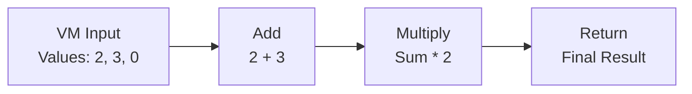

# VM Workflow System - Complete Guide

## 🚀 **Overview**

The VM Workflow System transforms your visual workflow builder into a powerful bytecode generator for the VM contract. Instead of generating Solidity contracts, you can now create VM bytecode that executes mathematical operations efficiently on-chain.

## 🎯 **How It Works**

### Architecture Flow:
```
User Creates Workflow (VM Blocks) → Slot Allocation → Instruction Generation → Bytecode Generation → VM Execution
```

### Key Components:
1. **VM Blocks**: Visual blocks representing VM opcodes (add, mul, isEven, special, return)
2. **Input Block**: Initializes VM buffer with values
3. **Slot Allocation**: Automatically assigns buffer indices (0-255)
4. **Bytecode Generation**: Creates hex bytecode following VM format
5. **Export System**: Generates ready-to-use bytecode and integration guides

## 🧩 **Available VM Blocks**

| Block | Opcode | Description | Inputs | Output |
|-------|--------|-------------|--------|--------|
| **VM Input** | - | Initialize buffer values | User-defined values | Buffer slots 0, 1, 2... |
| **Add** | 0 | Add two numbers | Value A, Value B | Sum |
| **Multiply** | 1 | Multiply two numbers | Value A, Value B | Product |
| **Is Even** | 2 | Check if number is even | Value | 1 (even) or 0 (odd) |
| **Special** | 3 | Return special value (69) | None | 69 |
| **Return** | 4 | Return a value from workflow | Return Value | Workflow result |

## 📋 **Example Workflow**

Let's recreate the `testMultipleInstructions` example from the test:

### Workflow: `(2 + 3) * 2 = 10`



### Generated Output:
- **Initial Values**: `[2, 3, 0]`
- **Bytecode**: `0x030000000000000000000000000000000000000000000000000000000000000002000000000000000000000000000000000000000000000000000000000000000300000000000000000000000000000000000000000000000000000000000000000000010201020020000402`
- **Expected Result**: `10`

## 🔧 **System Components**

### 1. Block Palette Integration

```typescript
// New VM blocks in block-palette.tsx
{
  name: "VM Blocks",
  blocks: [
    { id: "vm-input", name: "VM Input", icon: Database },
    { id: "vm-add", name: "Add", icon: Plus },
    { id: "vm-mul", name: "Multiply", icon: X },
    { id: "vm-iseven", name: "Is Even", icon: CheckCircle },
    { id: "vm-special", name: "Special", icon: Zap },
    { id: "vm-return", name: "Return", icon: CornerDownLeft },
  ],
}
```

### 2. Workflow Engine Processing

```typescript
// VM-specific interfaces in workflow-engine.ts
export interface VMInstruction {
  opcode: number           // 0=add, 1=mul, 2=isEven, 3=special, 4=return
  nodeId: string          // Source workflow node ID  
  nodeName: string        // Human readable name
  args: number[]          // Buffer slot arguments
  result?: number         // Buffer slot for result
}

export interface VMSlotAllocation {
  slotIndex: number       // Buffer slot index (0-255)
  nodeId: string         // Node that writes to this slot
  outputName: string     // Semantic name like "sum", "product"
  dataType: "uint256"    // Always uint256 for VM
  isInput: boolean       // True if initial input value
  value?: number         // For input slots, the initial value
}
```

### 3. Automatic Slot Allocation

The system automatically assigns buffer slots:

```typescript
// Input values get slots 0, 1, 2...
vm-input: [100, 200, 300] → slots 0, 1, 2

// Operations get result slots 3, 4, 5...
vm-add result → slot 3
vm-mul result → slot 4
```

### 4. Bytecode Format

Following the VM contract specification:

```
Byte 0: Count of initial uint256 values (1 byte)
Bytes 1-N: Initial uint256 values (32 bytes each, big-endian)
Bytes N+1...: Instructions:
  - add (0): [0, arg1_slot, arg2_slot, result_slot]
  - mul (1): [1, arg1_slot, arg2_slot, result_slot]
  - isEven (2): [2, arg_slot, result_slot] 
  - special (3): [3, result_slot]
  - return (4): [4, return_slot]
```

## 🎨 **User Experience**

### Abstract Interface Design

Users work with semantic concepts, not buffer slots:

```
Instead of: "Add slot 0 + slot 1 → slot 2"
Users see: "Add First Number + Second Number → Sum"
```

### Automatic Data Flow

When connecting VM blocks:
1. **No modal** appears (unlike contract blocks)
2. **Automatic slot resolution** based on node connections
3. **Visual feedback** shows data flow with semantic names

## 📤 **Export System**

### Dual Export Mode

The system automatically detects workflow type:

```typescript
// Detects VM blocks and switches to VM export
const hasVMBlocks = nodes.some(node => node.type.startsWith("vm-"))

if (hasVMBlocks) {
  // Export VM bytecode
  const vmExport = workflowEngine.exportWorkflowForVM(workflowId, nodes)
} else {
  // Export contract calls (existing system)
  const contractExport = workflowEngine.exportWorkflowForContract(workflowId, nodes)
}
```

### VM Export Object

```json
{
  "workflowId": "vm_workflow_1736832424",
  "version": "1.0.0",
  "exportType": "vm-bytecode",
  "vmInstructions": [
    {
      "opcode": 0,
      "nodeId": "vm-add-123",
      "nodeName": "Add Numbers",
      "args": [0, 1],
      "result": 3
    }
  ],
  "slotAllocations": [
    {
      "slotIndex": 0,
      "nodeId": "vm-input-123",
      "outputName": "input_0",
      "isInput": true,
      "value": 2
    }
  ],
  "initialValues": [2, 3, 0],
  "bytecode": "0x03000000000000000000...",
  "metadata": {
    "createdAt": 1736832424,
    "vmInstructionCount": 3,
    "bufferSlotsUsed": 4
  }
}
```

## 🔗 **Integration Examples**

### Smart Contract Integration

```solidity
pragma solidity ^0.8.0;
import "./VM.sol";

contract MyWorkflowContract {
    VM public vmContract;
    
    constructor(address _vmAddress) {
        vmContract = VM(_vmAddress);
    }
    
    function executeMyWorkflow() external returns (uint256) {
        bytes memory bytecode = hex"030000000000000000000000000000000000000000000000000000000000000002000000000000000000000000000000000000000000000000000000000000000300000000000000000000000000000000000000000000000000000000000000000000010201020020000402";
        return vmContract.execute(bytecode);
    }
}
```

### Web3 Frontend Integration

```javascript
// Execute VM workflow from frontend
const vmContract = new web3.eth.Contract(VM_ABI, VM_CONTRACT_ADDRESS);
const bytecode = "0x030000000000000000000000000000000000000000000000000000000000000002000000000000000000000000000000000000000000000000000000000000000300000000000000000000000000000000000000000000000000000000000000000000010201020020000402";

const result = await vmContract.methods.execute(bytecode).call();
console.log("Workflow result:", result); // Should output: 10
```

## 🛠 **Technical Implementation Details**

### Slot Resolution Algorithm

```typescript
private resolveInputSlot(inputRef: any, slotAllocations: VMSlotAllocation[]): number {
  if (typeof inputRef === 'string' && inputRef.includes('${') && inputRef.includes('_result.')) {
    // Parse expressions like "${vm-add-123_result.sum}"
    const match = inputRef.match(/\$\{([^_]+)_result\.([^}]+)\}/)
    if (match) {
      const [, nodeId, outputName] = match
      const slot = slotAllocations.find(slot => 
        slot.nodeId === nodeId && slot.outputName === outputName
      )
      return slot?.slotIndex ?? 0
    }
  }
  return Number(inputRef) || 0
}
```

### Bytecode Generation

```typescript
private generateVMBytecode(initialValues: number[], instructions: VMInstruction[]): string {
  const bytes: number[] = []
  
  // 1. Count of initial values
  bytes.push(initialValues.length)
  
  // 2. Initial uint256 values (32 bytes each, big-endian)
  for (const value of initialValues) {
    const valueBytes = this.uint256ToBytes(value)
    bytes.push(...valueBytes)
  }
  
  // 3. Instructions
  for (const instr of instructions) {
    bytes.push(instr.opcode)
    // Add arguments based on opcode type
    if (instr.opcode === 0 || instr.opcode === 1) { // add, mul
      bytes.push(instr.args[0], instr.args[1], instr.result!)
    }
    // ... handle other opcodes
  }
  
  return "0x" + bytes.map(b => b.toString(16).padStart(2, '0')).join('')
}
```

## 🎯 **Benefits**

### For Developers:
- **Visual VM Programming**: Create complex mathematical workflows visually
- **Automatic Optimization**: System handles slot allocation and bytecode generation
- **Integration Ready**: Get bytecode and integration guides immediately
- **Extensible**: Easy to add new VM opcodes as blocks

### For Users:
- **No Gas Overhead**: VM execution is more gas-efficient than contract calls
- **Deterministic**: Same workflow always produces same bytecode
- **Portable**: Bytecode works with any VM contract deployment
- **Debuggable**: Clear mapping between visual blocks and VM operations

## 🔮 **Future Extensions**

1. **More Opcodes**: Add loops, conditionals, memory operations
2. **Debug Mode**: Step-through execution with buffer state visualization  
3. **Optimization**: Detect redundant operations and optimize bytecode
4. **Simulation**: Run workflows in browser before deployment
5. **Templates**: Pre-built workflows for common mathematical operations

---

## 🚀 **Getting Started**

1. **Drag VM blocks** from the palette to create your workflow
2. **Connect blocks** to define data flow (automatic slot assignment)
3. **Configure input values** in the VM Input block
4. **Export workflow** to get bytecode and integration guides
5. **Deploy and execute** using the VM contract

The VM Workflow System transforms complex mathematical operations into efficient, visual, and deployable blockchain code! 🎉

